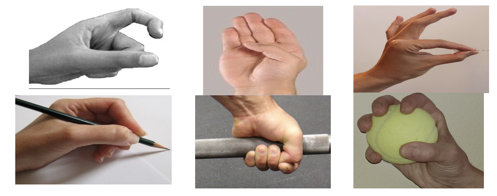

## SEMG Hand Gesture Classification for Transradial Amputees

> **Classification of Hand Gestures using SEMG Signals with Force Variation for Transradial Amputees**  
> Arindam Dev, Md. Fazle Elahi, M. M. Harun-Ur-Rashid
> Department of EEE, Bangladesh University of Engineering and Technology (BUET)

---

## Overview

A pattern recognition based method for classifying **6 hand gestures** from surface EMG (SEMG) signals of **transradial amputees**, robust to force level variation. The method proposes a novel orientation-based feature set and a channel selection algorithm using Recursive Feature Elimination (RFE), achieving state-of-the-art accuracy with an SVM classifier.

---

## Key Contributions

- **Novel orientation-based feature set** — less sensitive to force level variation than raw features
- **Channel selection via RFE** — reduces channels from 12 to optimal 5, improving accuracy by **3.2%** over sequential selection
- **High accuracy at all force levels** — especially at high force where prior methods degrade significantly
- Validated on a **public benchmark dataset** of 9 transradial amputees

---

## Dataset

| Property | Details |
|---|---|
| Source | [Khushaba EMG Repository](https://rami-khushaba.com/biosignals-repository) |
| Subjects | 9 transradial amputees (TR1–TR7, CG1, CG2) |
| Gestures | Index flexion, Thumb flexion, Fine pinch, Tripod grip, Hook grip, Spherical grip  |
| Force Levels | Low, Medium, High |
| Sampling Rate | 2 kHz |
| Channels | 8–12 per subject |

---

## Methodology

```
Raw SEMG Signal
      │
      ▼
┌─────────────────────┐
│   Feature Extraction │  ← m0, μ2, μ4, SSC, DASDV, MAV (from raw + log-mapped signal)
└─────────────────────┘
      │
      ▼
┌─────────────────────┐
│ Orientation Features │  fi = -2*ai*bi / (ai² + bi²)
└─────────────────────┘
      │
      ▼
┌─────────────────────┐
│  Channel Selection   │  ← Recursive Feature Elimination (RFE) → top 5 channels
└─────────────────────┘
      │
      ▼
┌─────────────────────┐
│   SVM (RBF Kernel)  │  ← One-vs-All multiclass, grid search for C & γ
└─────────────────────┘
      │
      ▼
   6-Class Gesture Output
```

### Features Extracted

| Feature | Symbol | Type |
|---|---|---|
| Root square zero-order moment | m₀ | Frequency (via Parseval's) |
| Second-order central moment | μ₂ | Time domain |
| Fourth-order central moment | μ₄ | Time domain |
| Slope sign change | SSC | Time domain |
| Diff. absolute standard deviation | DASDV | Time domain |
| Mean absolute value | MAV | Time domain |

All features are **power-normalized** (λ = 0.2) and extracted from both raw signal `x` and `log(x²)`, then combined using the orientation formula.

---

## Results

### Accuracy vs Number of Channels

| Channels | Low FL | Medium FL | High FL | All FL | Time/Segment |
|---|---|---|---|---|---|
| 4 | 93.8% | 93.1% | 88.9% | 92.3% | 2.62 ms |
| **5** | **95.3%** | **94.8%** | **90.2%** | **93.5%** | **2.79 ms** |
| 6 | 96.6% | 96.4% | 91.2% | 95.1% | 2.95 ms |
| 8 | 97.6% | 97.3% | 93.0% | 96.2% | 4.03 ms |

> ✅ **5 channels** selected as optimal — best accuracy-to-speed tradeoff.

### Comparison with State-of-the-Art (5 channels each)

| Method | Low FL | Medium FL | High FL | All FL |
|---|---|---|---|---|
| **Proposed** | **95.3%** | **94.8%** | **90.2%** | **93.7%** |
| TD-PSD [Al-Timemy 2016] | 89.6% | 87.5% | 80.1% | 86.3% |
| TD Features [Al-Timemy 2013] | 81.8% | 80.3% | 71.8% | 78.6% |
| Combined [He 2015] | 92.4% | 91.8% | 79.5% | 88.4% |

---

## Statistical Validation

- **Kruskal-Wallis test** confirms features significantly discriminate gestures (p < 0.05 for all 6 features)
- **Cohen's Kappa**: κ = 0.9447 (Low), 0.9378 (Medium), 0.8822 (High) — strong classifier agreement

---

## Tech Stack


---

## Acknowledgements

Supervised by **Dr. Mohammed Imamul Hassan Bhuiyan**, Professor, Department of EEE, BUET.  
Dataset provided by [Rami Khushaba's EMG Repository](https://rami-khushaba.com/biosignals-repository).
